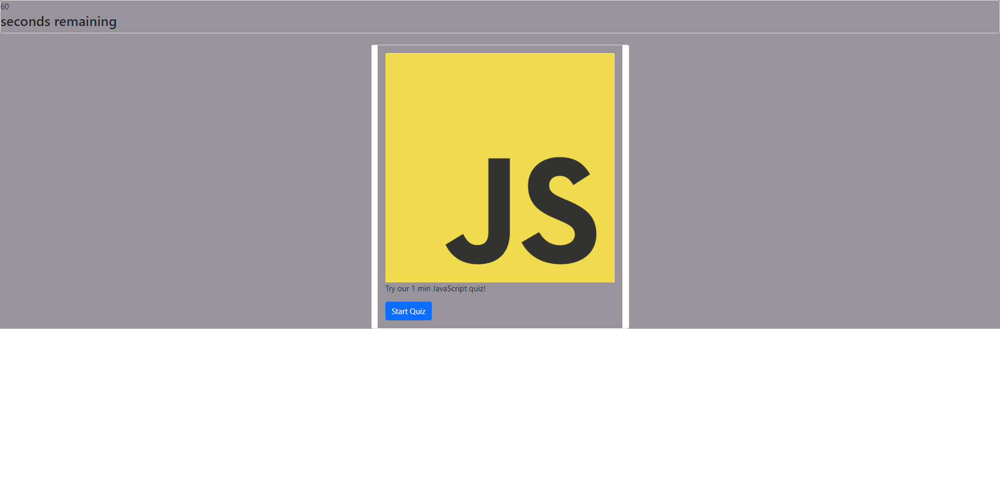

# timed-quiz

## My Task

This week's Challenge was to make a quiz based on the funadamentals of JavaScript

## Table of contents

- [User Story](#userstory)
- [Acceptance Criteria](#AcceptanceCriteria)
- [Preview](#preview)
- [Contributing](#contributing)
- [License](#license)


## User Story

```
AS A coding boot camp student
I WANT to take a timed quiz on JavaScript fundamentals that stores high scores
SO THAT I can gauge my progress compared to my peers

```

## Acceptance Criteria

```
GIVEN I need a new, secure password
WHEN I click the button to generate a password
THEN I am presented with a series of prompts for password criteria
WHEN prompted for password criteria
THEN I select which criteria to include in the password
WHEN prompted for the length of the password
THEN I choose a length of at least 8 characters and no more than 128 characters
WHEN asked for character types to include in the password
THEN I confirm whether or not to include lowercase, uppercase, numeric, and/or special characters
WHEN I answer each prompt
THEN my input should be validated and at least one character type should be selected
WHEN all prompts are answered
THEN a password is generated that matches the selected criteria
WHEN the password is generated
THEN the password is either displayed in an alert or written to the page
```


## Preview

[Deployed Link](https://janiece-lewis.github.io/timed-quiz/)

## Contributing
Pull requests are welcome. For major changes, please open and issue first to discuss what you would like to change.


## License
[MIT](https://choosealicense.com/licenses/mit/)
